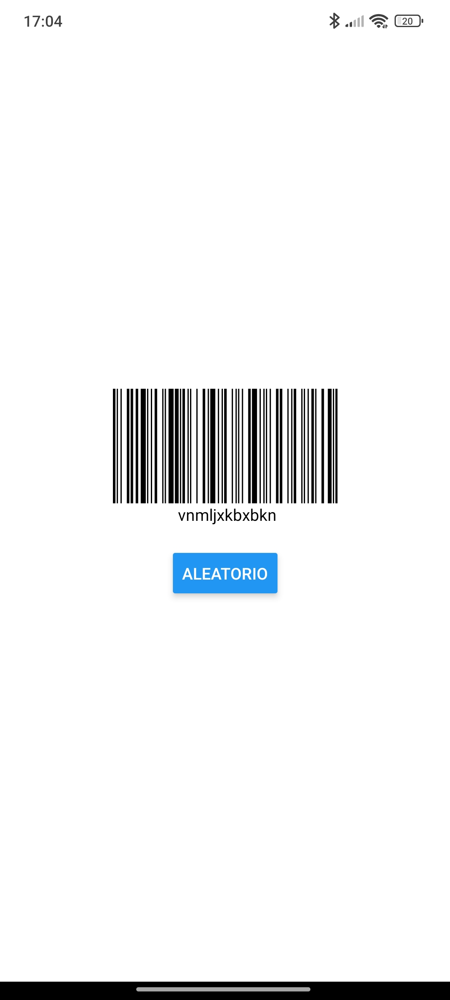

# react-native-svg-barcode

A React Native component that displays barcodes using SVG.



## Installation

```sh
npm install react-native-svg react-native-svg-barcode
```

Or

```sh
yarn add react-native-svg react-native-svg-barcode
```

## Example

<a href="https://github.com/cervisebas/react-native-svg-barcode/tree/main/example" target="_blank">
    See example folder
</a>

## Properties

| Prop       | Required | Type                    | Description                                             |
| ---------- | -------- | ----------------------- | ------------------------------------------------------- |
| value      | YES      | `string`                | Value to encode into a barcode.                         |
| width      | NO       | `number`                | The width of a single bar.                              |
| maxWidth   | NO       | `number`                | The max width of the barcode.                           |
| height     | NO       | `number`                | The height of the barcode.                              |
| format     | NO       | `Format`                | Select which [barcode type](#supported-formats) to use. |
| lineColor  | NO       | `string`                | Sets the color of the lines.                            |
| background | NO       | `string`                | Set the color of the container.                         |
| text       | NO       | `ReactNode` or `string` | An optional text that will be render under the barcode. |
| textStyle  | NO       | `TextStyle`             | Styles to be applied on the text component.             |
| style      | NO       | `ViewStyle`             | Styles to be applied on the container.                  |
| onError    | NO       | `function`              | An optional error handler.                              |


## Supported formats

- CODE39
- CODE128
- CODE128A
- CODE128B
- CODE128C
- EAN13
- EAN8
- EAN5
- EAN2
- UPC
- UPCE
- ITF14
- ITF
- MSI
- MSI10
- MSI11
- MSI1010
- MSI1110
- pharmacode
- codabar

## Contributing

See the [contributing guide](CONTRIBUTING.md) to learn how to contribute to the repository and the development workflow.

## License

MIT

---

Made with [create-react-native-library](https://github.com/callstack/react-native-builder-bob)
